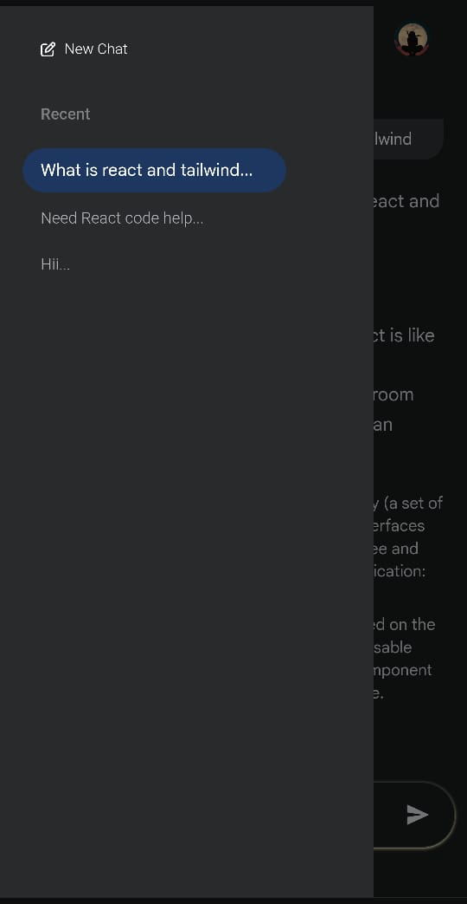
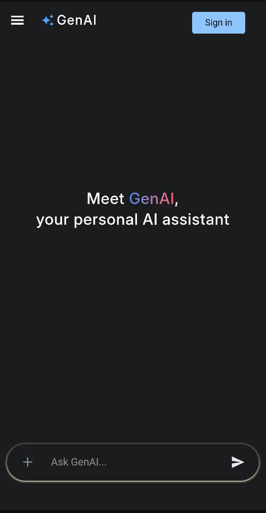

# GenAI Assistant 🤖


A sleek and modern Google Gemini-inspired AI chatbot built using **React**, **Tailwind CSS**, **Firebase**, **Redux Toolkit**, and **Google Gemini API**, featuring real-time typing effects, animated UI, multi-device support, and Firestore integration for chat history and user profiles.

## ✨ Features

- 🎉 **Beautiful Gemini-like UI** with smooth transitions and responsive design
- ✍️ **Typing animation effect** for realistic AI responses
- 🔍 Intelligent **recent chats sidebar** with Firestore sync
- 📅 **Timestamped & titled chat sessions** stored securely in Firestore
- 👤 **Login / Signup via Firebase Auth**
- ✖️ Works in **guest mode** without saving chat history
- 📂 **Persistent chat experience** (with Redux & LocalStorage)
- ✏️ **Markdown supported** AI replies with code block highlighting
- 🙋 User feedback with **like/dislike animations** on each response
- 🚀 **Mobile-optimized layout** with collapsible and slide-in sidebar
- 🚧 Deployed with **Vercel Serverless Functions** to securely call the OpenRouter API

## 🪨 Tech Stack

- React + Vite
- Tailwind CSS
- Redux Toolkit
- React Router DOM
- Firebase Auth
- Firestore Database
- Gemini API (GPT-compatible)
- React Markdown + Rehype Highlight + Remark GFM + Framer Motion
- Vercel Deployment + Vercel Functions

## 📸 Screenshots

### Desktop UI

()

### Mobile UI

<div align="center">
  
  &nbsp;
  
</div>

## 📂 Folder Structure

````bash
src/
├── assets/                     # Fonts, logos, images
├── auth/
│   └── auth.js                 # Firebase auth utils
├── Components/
│   ├── AuthUserComp/           # Components used by logged-in users
│   │   ├── Chatbox.jsx
│   │   ├── ChatInterface.jsx
│   │   ├── MobileSidebar.jsx
│   │   ├── ProfileDropdown.jsx
│   │   ├── UserNavbar.jsx
│   │   └── UserSidebar.jsx
│   └── VisitorComp/            # Components used by visitors
│       ├── VisitorChatbox.jsx
│       ├── VisitorNavbar.jsx
│       ├── VisitorSidebar.jsx
│       └── VisMobileSidebar.jsx
├── context/
│   └── AuthContext.jsx         # Provides auth state
├── firebase/
│   ├── firebase.js             # Firebase config
│   └── fireStoreUtils.js       # Firestore functions
├── pages/
│   ├── User/
│   │   ├── Home.jsx
│   │   └── LoginPage.jsx
│   └── Visitor/
│       └── LandingPage.jsx
├── redux/
│   ├── chatSlice.js            # Redux slice for chat state
│   └── store.js
├── Route/
│   └── ProtectedRoute.jsx      # Guards private routes
├── utils/
│   ├── SpinnerOverlay.jsx
│   └── SvgComponent.jsx
├── App.jsx
├── index.js
├── main.jsx
├── index.css
├── .gitignore
├── eslint.config.js
├── index.html
├── package-lock.json
├── package.json
└── README.md

```
## 🔧 Installation

```bash
git clone [https://github.com/sumitattri/gen-ai-clone.git](https://github.com/Sumiattri/GenAI_Assistant.git)
cd genai-clone
npm install
npm run dev
````

> 🚨 Don't forget to add your Gemini API key and Firebase config in the `.env.local` file.

---

## Contact

Created by [@sumitattri](https://github.com/Sumiattri)  
📧 Email: sumitattri165@gmail.com  
🔗 LinkedIn: (https://www.linkedin.com/in/sumit-attri-3147b9257?utm_source=share&utm_campaign=share_via&utm_content=profile&utm_medium=android_app)

---

## 🚀 Try It Live

(gen-ai-assistant.vercel.app)

---

> ✨ This is not just a clone, it's an experience.
